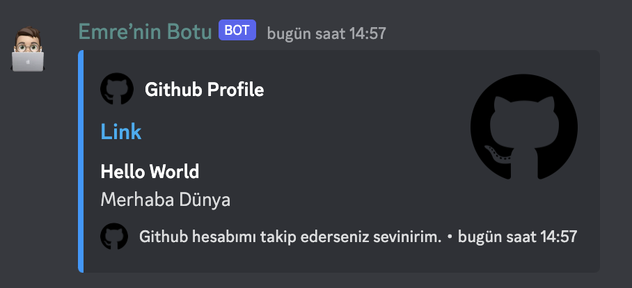

# Market Uygulaması Demo

Projeyi çalıştırmadan önce `SendChannelMessage.js` dosyasının içerisindeki `token` ve `kanal_id` metinlerini kendi bilgileriniz değiştirmeyi unutmayınız.

Projeyi çalıştırmak için aşağıdaki komutları kullanmalısınız.
## 1 -  `npm install`
## 2 -  `node SendChannelMessage.js`

# PROJEYE AİT GÖRÜNTÜ
  
